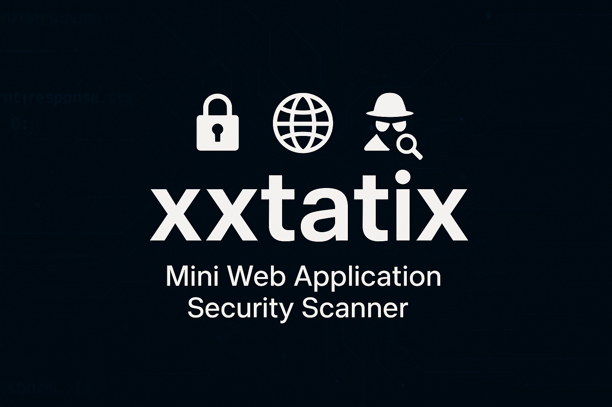

<p align="center">
  
</p>

# xxtatix — Mini Web Application Security Scanner

[](https://www.python.org/)


**xxtatix** is a lightweight scanner for learning and portfolio use. It performs:
- Security headers audit
- Basic reflected XSS probes
- Simple open-redirect detection
- Directory/file discovery with a wordlist

> ⚠️ Educational use only. Scan systems you own or have explicit permission to test.

---

## Installation
```bash
git clone https://github.com/<your-username>/xxtatix.git
cd xxtatix
python -m venv venv
# Linux/Mac
source venv/bin/activate
# Windows (PowerShell)
# .\venv\Scripts\Activate.ps1
pip install -r requirements.txt

Usage

# Quick scan
python xxtatix.py -u https://example.com

# Save JSON report
python xxtatix.py -u https://example.com --json report.json

# Use custom wordlist/payloads and more threads
python xxtatix.py -u https://example.com --wordlist wordlist.txt --payloads payloads.txt --threads 20

# Allow self-signed certs (labs)
python xxtatix.py -u https://127.0.0.1 --insecure

Examples
Console output (sample)

╔═══════════════════════════════════════════╗
║          ✦  X X T A T I X  ✦              ║
╚═══════════════════════════════════════════╝

   ⚡ Mini Web Application Security Scanner ⚡
                 by Amit

Target: https://testphp.vulnweb.com

[+] Checking Security Headers...
Headers: 100%|████████| 8/8 [00:00<00:00, ...]
...
[+] No reflected XSS detected with basic payloads.
[+] No open redirects detected with basic probes.
[!] Interesting directories/files found:
   https://testphp.vulnweb.com/robots.txt  [200]

JSON example

python xxtatix.py -u https://testphp.vulnweb.com --json examples/report.json

Files

xxtatix/
├─ xxtatix.py
├─ payloads.txt
├─ wordlist.txt
├─ requirements.txt
├─ README.md
├─ LICENSE
├─ xxtatix-banner.png   # optional banner image
└─ demo.gif             # optional demo GIF

Legal / Ethics Notice

    This tool is for education. Use only on assets you own or have explicit permission to test.
